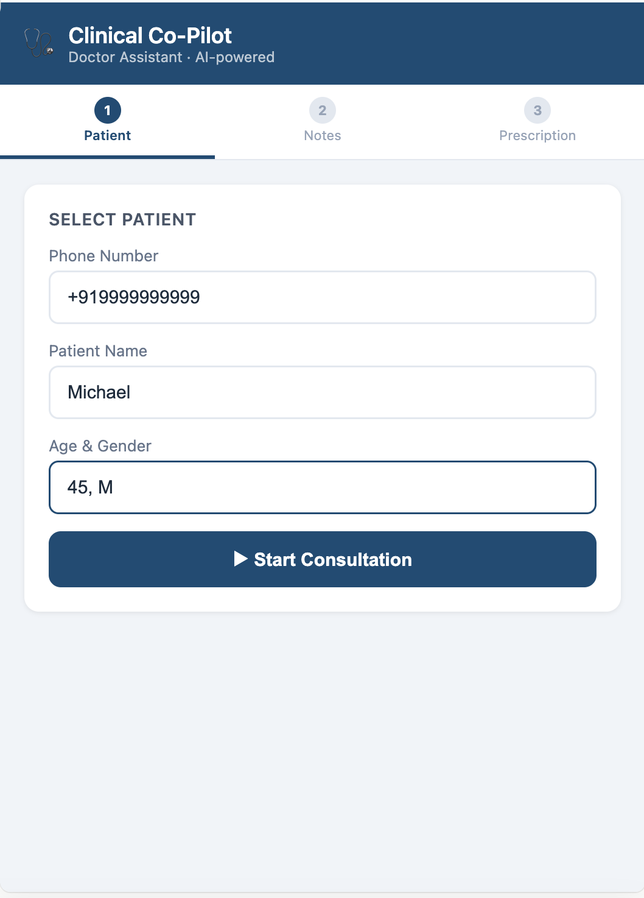
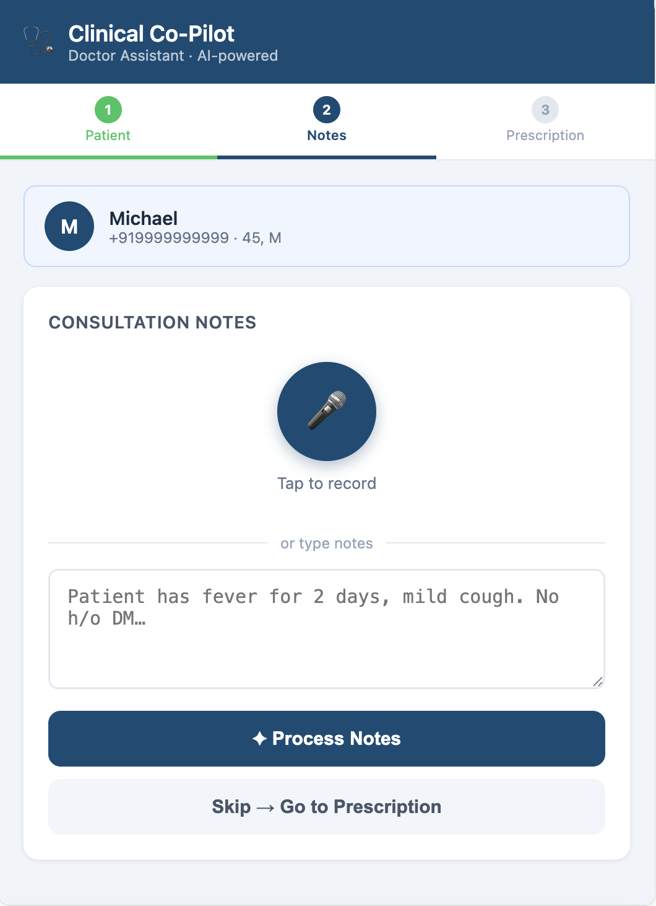
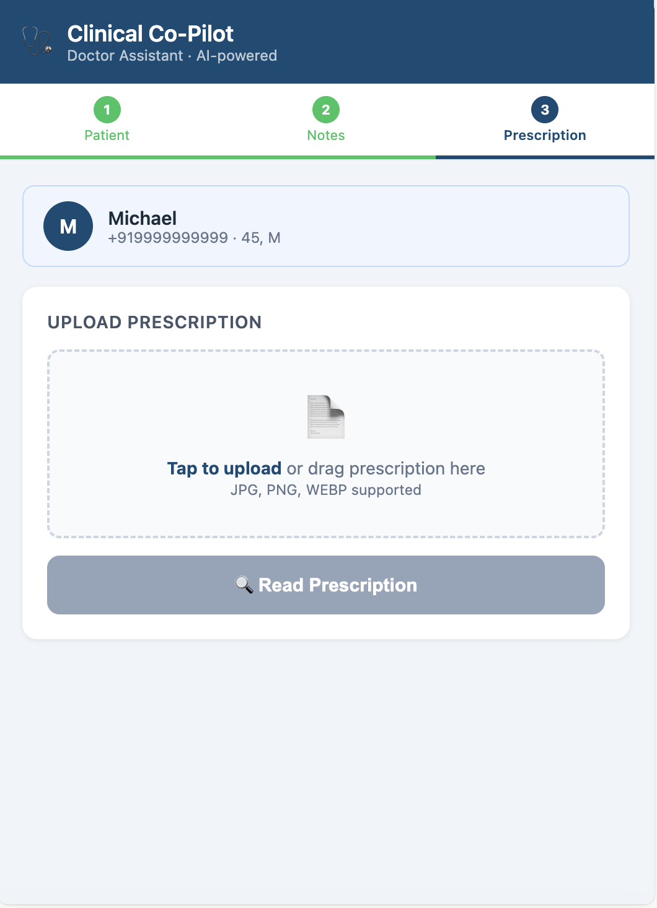

# 🩺 Clinical Co-Pilot — Agentic AI Assistant for Small Clinics

An AI-powered clinical assistant built for small general clinics in India. It reduces the doctor's cognitive load by structuring handwritten prescriptions, transcribing consultation audio, analysing blood reports, and maintaining a persistent patient history — while keeping the doctor fully in control of every decision.

> **This is a clinical decision support tool, not a medical device.**
> All outputs require doctor review and approval before any action is taken.

---

## UI Screenshots

| Step 1 — Patient | Step 2 — Consultation Notes | Step 3 — Prescription |
|---|---|---|
|  |  |  |

The interface is a 3-step flow: select or register the patient → record or type consultation notes → upload the prescription image. Each step feeds the next, and the AI processes inputs in the background before presenting results for doctor review.

Once past the patient entry screen, a **hamburger menu** appears in the top-right corner of the header. It gives the doctor quick access to patient-specific features without leaving the consultation flow.

---

## Why This Exists

In a small general clinic seeing 10–15 patients a day:

- Prescriptions are handwritten and unstructured
- Blood reports require manual scanning for abnormalities
- Patient history is fragmented or memory-dependent
- Doctors spend time on repetitive cognitive work instead of patient care

This system **augments the doctor, not replaces them.**

---

## What's Been Built

### Phase 1 — Prescription Reader
Upload a handwritten or printed prescription image. The agent extracts structured medication details:

| Field | Example |
|---|---|
| Medicine name | Amoxicillin |
| Dosage | 500 mg |
| Frequency (raw) | `1-0-1` |
| Frequency (decoded) | Morning and Night |
| Meal timing | `AC` → Before food |
| Duration | 5 days |
| Special instructions | Avoid alcohol |
| Flags | Unclear dosage, missing duration |

Unclear or unreadable fields are flagged rather than guessed.

---

### Phase 2 — Consultation Notes Agent
Record the doctor's spoken consultation (Telugu, Hindi, English, or any mix). The agent transcribes and structures it into:

- Chief complaints
- History
- Examination findings
- Diagnosis / impression *(only if doctor explicitly states it — never inferred)*
- Instructions
- Follow-up

**Supports:** Telugu + Hindi + English code-switching
**Input:** Live mic recording in the browser, or `.m4a`, `.mp3`, `.wav`, `.webm` files

---

### Phase 3 — WhatsApp Message Generator
Takes the structured prescription (and optional consultation notes) and generates a patient-friendly WhatsApp message:

```
Hi Ramesh,

Here are your medicines from today's visit:

💊 Amoxicillin 500mg — After breakfast and after dinner — for 5 days
💊 Paracetamol 650mg — After food (only if fever) — as needed

Rest well and drink plenty of fluids.
If you have any concerns, please call the clinic.
⚠️ Please confirm with your doctor before any changes.
```

The doctor reviews and edits the message, then clicks **"Send to Patient WhatsApp"** — the message is delivered directly to the patient via the Twilio WhatsApp API. No manual copy-paste or phone required.

---

### Phase 4 — Blood Report Analyser
Upload a blood report PDF or image. Two agents run in sequence:

**Agent 1 — Report Reader**
Extracts every parameter with value, unit, reference range, and status:

| Parameter | Value | Unit | Range | Status |
|---|---|---|---|---|
| Haemoglobin | 9.2 | g/dL | 13.0–17.0 | 🔴 Low |
| Blood Glucose (F) | 92 | mg/dL | 70–100 | 🟢 Normal |
| Platelets | 48,000 | cells/μL | 1.5L–4.5L | 🔴 Critical |

**Agent 2 — Summary Generator**
Produces a plain-English summary for the doctor:

> *"Most of your blood test results are within the normal range. Your haemoglobin is slightly low and your platelet count needs immediate attention — your doctor will discuss this with you."*

---

### Phase 5 — Patient History Store
All doctor-approved records are saved to **Cloud Firestore**. Nothing is saved without explicit doctor approval.

**Firestore structure:**
```
patients/
  {phone_number}/
    profile/             → name, age, gender, phone, updated_at
    prescriptions/       → {doc_id}: PrescriptionOutput + saved_at
    consultations/       → {doc_id}: ConsultationNotes + saved_at
    blood_reports/       → {doc_id}: { report, summary, saved_at }
    insights/
      latest             → PatientInsights (auto-refreshed on every save)
```

- Phone number is the patient identifier (aligns with WhatsApp)
- All records are timestamped with UTC `saved_at`
- Profile upserts use `merge=True` to avoid overwriting existing data

---

### Phase 6 — Patient Insights
After every doctor-approved save, insights are automatically regenerated from the full patient history and cached in Firestore.

**What it analyses:**
- Blood parameter trends across reports (e.g. Hb declining visit-over-visit)
- Recurring complaints and diagnoses across consultations
- Medications that keep reappearing (suggesting chronic or unresolved conditions)

**Output (`PatientInsights`):**

| Field | Description |
|---|---|
| `trends` | Per-parameter trend with direction: improving / worsening / stable / fluctuating |
| `risk_flags` | Predicted risks with severity (low / medium / high), evidence, and recommendation |
| `recurring_patterns` | Complaints, medications, diagnoses appearing across multiple visits |
| `overall_assessment` | Plain-English paragraph summarising the patient's health trajectory |

**Example risk flag:**
> *"Haemoglobin has dropped from 13.2 → 11.8 → 10.2 g/dL across 3 reports despite iron prescription — possible compliance issue or absorption problem."*

The doctor can also trigger a manual refresh from the Patient Insights panel.

---

### Phase 8 — WhatsApp Send Integration *(Latest)*
After the `message_creator_agent` drafts the patient message, a **"Send to Patient WhatsApp"** button in the UI triggers a `POST /send-whatsapp` call. The backend sends the message via the **Twilio WhatsApp API** — no WhatsApp Business account required, just a Twilio sandbox number.

**Flow:**
1. Doctor reviews (and optionally edits) the drafted message
2. Clicks "Send to Patient WhatsApp"
3. Backend calls Twilio → patient receives message on WhatsApp
4. Button shows "✅ Sent" confirmation; errors surface as a toast

**Required env vars:**
```
TWILIO_ACCOUNT_SID=ACxxxxxxx
TWILIO_AUTH_TOKEN=xxxxxxx
TWILIO_WHATSAPP_FROM=whatsapp:+14155238886   # Twilio sandbox default
```

---

### Phase 7 — Hamburger Menu & Patient Insights UI
A slide-out drawer accessible from screens 2 and 3 (after patient entry). Tapping **Patient Insights** opens a full-screen panel that loads the cached insights and renders them as structured cards (overall assessment, risk flags with colour-coded severity, trends with directional arrows, recurring patterns as chips).

The drawer acts as an extensibility hub for all upcoming patient-specific features:

| Section | Status |
|---|---|
| Patient Insights | ✅ Live |
| Visit History | Coming soon |
| Reports (Blood reports, X-rays, MRIs) | Coming soon |
| Prescriptions | Coming soon |
| Vitals tracker | Coming soon |
| Allergies & alerts | Coming soon |

---

## Architecture

```
                        ┌─────────────────────┐
                        │   Doctor Interface   │
                        │  (FastAPI + Web UI)  │
                        └──────────┬──────────┘
                                   │
                    ┌──────────────▼──────────────┐
                    │       Root Orchestrator      │
                    │       (clinical_copilot)     │
                    └──┬──────┬──────┬──────┬─────┘
                       │      │      │      │
           ┌───────────▼┐ ┌───▼──┐ ┌▼────┐ ┌▼──────────────┐
           │Prescription│ │Notes │ │Msg  │ │  Blood Report  │
           │  Reader    │ │Agent │ │Agent│ │ Reader+Summary │
           └───────────┬┘ └───┬──┘ └┬────┘ └┬──────────────┘
                       │      │      │       │
                    ┌──▼──────▼──────▼───────▼──┐
                    │      Doctor Review         │
                    │   (approve / edit / skip)  │
                    └──────────────┬─────────────┘
                                   │ approved
                    ┌──────────────▼─────────────┐
                    │     Cloud Firestore         │
                    │   Patient History Store     │
                    └──────────────┬─────────────┘
                                   │ on every save
                    ┌──────────────▼─────────────┐
                    │     Insights Generator      │
                    │  (async, cached to Firestore)│
                    └────────────────────────────┘
```

### Agents

| Agent | Role | Model |
|---|---|---|
| `prescription_reader_agent` | Extracts structured medicines from image/text | gemini-3.5-flash |
| `consultation_notes_agent` | Transcribes audio, structures consultation notes | gemini-3.5-flash |
| `blood_report_reader_agent` | Extracts parameters from blood report | gemini-3.5-flash |
| `blood_report_summary_agent` | Plain-English summary of blood report | gemini-3.5-flash |
| `message_creator_agent` | Generates WhatsApp patient message | gemini-flash-latest |
| `clinical_copilot` (root) | Orchestrator — routes to sub-agents | gemini-flash-latest |
| Insights generator | Analyses full history, produces risk flags and trends | gemini-3.5-flash |

---

## Tech Stack

| Layer | Technology |
|---|---|
| Agent framework | Google ADK (`google-adk`) |
| AI models | Gemini 3.5 Flash / Gemini Flash Latest (Vertex AI) |
| API server | FastAPI + Uvicorn |
| Patient store | Cloud Firestore |
| Audio | Google GenAI Files API |
| WhatsApp delivery | Twilio WhatsApp API |
| Language | Python 3.11+ |
| Package manager | `uv` |

---

## API Endpoints

| Method | Endpoint | Purpose |
|---|---|---|
| POST | `/api/prescription/read` | Upload prescription image → structured JSON |
| POST | `/api/notes/process` | Upload audio or text → consultation notes JSON |
| POST | `/api/message/generate` | Generate WhatsApp message from prescription + notes |
| POST | `/send-whatsapp` | Send approved message to patient via Twilio WhatsApp |
| POST | `/api/bloodreport/analyze` | Upload blood report → extract parameters + summary |
| POST | `/api/patient/save/prescription` | Doctor-approved save → patient history + refresh insights |
| POST | `/api/patient/save/consultation` | Doctor-approved save → patient history + refresh insights |
| POST | `/api/patient/save/bloodreport` | Doctor-approved save → patient history + refresh insights |
| GET | `/api/patient/{phone}/history` | Full patient history (all records) |
| GET | `/api/patient/{phone}/profile` | Patient profile |
| GET | `/api/patient/{phone}/insights` | Cached insights (202 if not yet generated) |
| POST | `/api/patient/{phone}/insights/refresh` | Force regenerate insights |

---

## Running Locally

```bash
# Clone
git clone https://github.com/ravikiran-tummala/clinical_agent.git
cd clinical_agent/clinical-agent

# Install dependencies
uv sync

# Authenticate with Google Cloud (Vertex AI)
gcloud auth application-default login

# The app auto-detects your GCP project. You can override:
# export GOOGLE_CLOUD_PROJECT="your-project-id"

# Run
uv run python ui_app.py
# Open http://localhost:8080
```

> **Note:** The app uses Vertex AI (not AI Studio) and auto-sets `GOOGLE_CLOUD_LOCATION=global` and `GOOGLE_GENAI_USE_VERTEXAI=True`. You need a GCP project with Vertex AI API enabled and application default credentials configured.

---

## Safety & Compliance

| Rule | Detail |
|---|---|
| No autonomous diagnosis | Agents never infer diagnosis unless doctor explicitly states it |
| No treatment suggestions | Agents only structure what the doctor has already prescribed |
| Doctor approval gate | Nothing is saved or sent to a patient without explicit approval |
| Disclaimers on all outputs | Every AI output carries a doctor-must-verify notice |
| Audit trail | All saves timestamped in Firestore |

---

## Roadmap

- [x] Phase 1 — Prescription reader + structured JSON
- [x] Phase 2 — Consultation notes from audio (Telugu/Hindi/English)
- [x] Phase 3 — WhatsApp message generator
- [x] Phase 4 — Blood report analyser + plain-English summary
- [x] Phase 5 — Patient history store (Firestore, phone-keyed)
- [x] Phase 6 — Patient insights: trends, risk flags, recurring patterns (auto-cached on every save)
- [x] Phase 7 — Hamburger menu with slide-out drawer and live Patient Insights panel
- [x] Phase 8 — WhatsApp send via Twilio (doctor approves → message delivered directly to patient)
- [ ] Visit history UI
- [ ] Reports UI (blood reports, X-rays, MRIs)
- [ ] Prescriptions history UI
- [ ] Vitals tracker with trend charts
- [ ] Allergies & alerts management
- [ ] Radiology report support (X-ray, MRI)
- [ ] Upgrade to WhatsApp Business API (production sender)
- [ ] Follow-up reminders

---

## Disclaimer

This software is intended strictly as a **clinical decision support tool**.

- It does **not** provide diagnoses
- It does **not** recommend treatments
- It does **not** replace medical judgment

Final medical decisions must always be made by a licensed physician.
